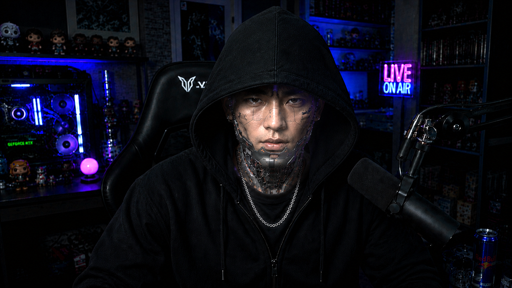

# 駁駁Bot (BokBok Bot)

[](https://github.com/thunder-shies/BokBokBot/blob/main/README.md)

> A satirical AI chat application that analyzes user input, generates contextual replies with behavioral metrics, and features real-time speech interaction in multiple languages with a futuristic robot interface.

## Video
[](https://www.youtube.com/embed/vSZg_2Pf2Zs)

## Overview

駁駁Bot is a full-stack web application that combines a stylized React interface with a FastAPI backend to create an interactive AI chat experience. The app features:

- **AI-Powered Analysis**: Analyzes user messages and generates contextual replies with three behavioral metrics (stupidity, conformity, polarization)
- **Multi-Language Support**: Bilingual UI (Traditional Chinese / English) with localized speech recognition and synthesis
- **Real-Time Speech I/O**: Browser-based voice input (speech-to-text) and audio output (text-to-speech)
- **Webcam Vision**: Detects and counts people in webcam frames with confidence scoring
- **Multiple LLM Providers**: Support for Gemini, Hugging Face, and Ollama with graceful fallback
- **Projection Mode**: Dedicated projection window for presentations or displays
- **Responsive Fallback**: Maintains chat functionality even when external services are unavailable

## Tech Stack

**Frontend:**
- React 19 with TypeScript
- Vite (dev server with API proxying)
- Tailwind CSS + Motion (Framer Motion)
- Web Speech API (STT/TTS)
- lucide-react (icons)
- i18n for localization

**Backend:**
- FastAPI + Uvicorn
- Python 3.10+
- Multiple LLM integrations (Gemini, Hugging Face, Ollama)
- OpenCV (vision detection)
- CORS-enabled for frontend communication

## Project Structure

```text
駁駁Bot/
├── src/                           # React frontend
│   ├── components/                # React components
│   │   ├── ChatInterface.tsx      # Main chat UI with speech controls
│   │   ├── ProjectionWindow.tsx   # Projection display mode
│   │   ├── WebcamPreview.tsx      # Vision detection panel
│   │   ├── RobotBackground.tsx    # Animated robot backdrop
│   │   └── ...
│   ├── services/                  # API and integrations
│   │   ├── chatApi.ts             # Chat API client
│   │   ├── gemini.ts              # Gemini service
│   │   └── ...
│   ├── i18n/                      # Localization
│   ├── hooks/                     # Custom React hooks
│   ├── App.tsx                    # Main app entry
│   └── main.tsx                   # Vite entry point
├── backend/
│   ├── app/
│   │   ├── routes/                # API endpoints
│   │   │   ├── chat.py            # Chat analysis endpoint
│   │   │   ├── stt.py             # Speech-to-text
│   │   │   └── vision.py          # Person detection
│   │   ├── services/              # Business logic
│   │   │   ├── llm_service.py     # LLM provider wrapper
│   │   │   └── vision_service.py  # Vision detection logic
│   │   └── models/                # Pydantic schemas
│   ├── config.py                  # Environment & settings
│   ├── main.py                    # Backend launcher
│   ├── requirements.txt           # Python dependencies
│   └── yolov8n.pt                 # YOLOv8 model (pre-downloaded)
├── vite.config.ts                 # Frontend dev proxy config
├── tsconfig.json
├── package.json
└── README.md
```


## Requirements

- **Node.js** 18 or later
- **Python** 3.10 or later
- **Operating System**: Windows (PowerShell), macOS, or Linux
- **Webcam** (optional, for vision features)
- **Microphone** (optional, for speech input)

## Quick Start

### 1. Clone and setup

```bash
git clone <repo-url>
cd 駁駁Bot
```

### 2. Frontend setup

```bash
npm install
npm run build        # Optional: production build
```

### 3. Backend setup

```powershell
# Create and activate Python virtual environment
python -m venv .venv
.\.venv\Scripts\Activate.ps1          # Windows
# source .venv/bin/activate           # macOS/Linux

# Install dependencies
pip install -r backend/requirements.txt
```

### 4. Environment configuration

Create `backend/.env` in the backend directory with your LLM provider settings:

```dotenv
# LLM Provider selection
LLM_PROVIDER=huggingface              # Options: huggingface, gemini, ollama

# Gemini Configuration (if using Gemini)
GEMINI_API_KEY=your_api_key_here
GEMINI_MODEL=gemini-1.5-flash
GEMINI_USE_VERTEX=false               # Set true to use Vertex AI instead of API key
GCP_PROJECT_ID=your_project_id
GCP_LOCATION=us-central1
GOOGLE_APPLICATION_CREDENTIALS=path/to/service-account.json

# Hugging Face Configuration (if using Hugging Face)
HF_TOKEN=hf_your_token_here
HF_MODEL=meta-llama/Llama-3.1-8B-Instruct
HF_PROVIDER=featherless-ai

# Ollama Configuration (if using Ollama locally)
OLLAMA_BASE_URL=http://localhost:11434
OLLAMA_MODEL=llama3.1

# Application Settings
APP_PORT=8001
CORS_ORIGINS=http://localhost:3000
VISION_CONFIDENCE_THRESHOLD=0.45
```

### 5. Run the application

**Terminal 1 - Backend:**
```powershell
cd backend
python main.py
# Backend runs at http://localhost:8001
```

**Terminal 2 - Frontend:**
```bash
npm run dev
# Frontend runs at http://localhost:3000
# Vite proxy automatically routes /api/* to backend
```

Visit `http://localhost:3000` in your browser and start chatting!

## Features

### Chat Interface
- **Text Input**: Type messages or use the send button
- **Voice Input**: Click the microphone icon to use speech recognition
- **AI Response**: Get immediate responses with behavioral metrics
- **Voice Output**: AI responses are automatically read aloud (can be muted)
- **Closed Captions**: All messages displayed with subtle animations
- **Live Feedback**: Real-time typing indicators and processing status

### Multi-Language Support
- **UI Languages**: Traditional Chinese (繁體中文) and English
- **Speech Recognition**: Adapted to selected language (Cantonese for 繁, English for EN)
- **Text-to-Speech**: Gender-aware voice synthesis in selected language
- **Toggle**: Language selector in the settings panel

### Vision Detection
- **Webcam Integration**: Real-time webcam feed with person detection
- **Accuracy Metrics**: Confidence scores for detections
- **YOLOv8 Model**: Pre-trained object detection model
- **Graceful Fallback**: Works offline if backend is unavailable

### Projection Mode
- **Dedicated View**: `projection.html` for external display
- **Synchronized**: Captions broadcast from main interface
- **Remote Control**: Can be controlled from main chat interface

## API Reference

### Health Check

**Endpoint:** `GET /health`

**Response:**
```json
{
  "status": "ok",
  "provider": "huggingface"
}
```

---

### Chat Analysis

**Endpoint:** `POST /api/chat/analyze`

**Request:**
```json
{
  "userInput": "你好世界",
  "locale": "zh-HK"
}
```

**Locale Options:**
- `zh-HK`: Traditional Chinese (Cantonese)
- `en`: English

**Response:**
```json
{
  "response": "Your AI-generated response here...",
  "metrics": {
    "stupidity": 0.21,
    "conformity": 0.44,
    "polarization": 0.39
  },
  "labels": ["label1", "label2", "label3"]
}
```

**Metrics Explanation:**
- **Stupidity**: How absurd or nonsensical the input is
- **Conformity**: How aligned with mainstream opinions
- **Polarization**: How extreme or divisive the sentiment is

---

### Vision Detection

**Endpoint:** `POST /api/vision/detect-person`

**Request:** Multipart form data
- Field name: `file`
- Content: Image file (JPEG, PNG)

**Response:**
```json
{
  "detected": true,
  "count": 2,
  "confidence": 0.87
}
```

**Fields:**
- `detected`: Whether any persons were found
- `count`: Number of persons detected
- `confidence`: Average confidence score (0-1)

---

## LLM Provider Setup

### Gemini (Google)

**Using API Key (Easier):**
1. Get your API key from [Google AI Studio](https://aistudio.google.com/app/apikey)
2. Set in `.env`:
   ```dotenv
   LLM_PROVIDER=gemini
   GEMINI_API_KEY=your_key_here
   ```

**Using Vertex AI (Service Account):**
1. Create a service account in GCP with Vertex AI User permission
2. Download the service account JSON key
3. Set in `.env`:
   ```dotenv
   LLM_PROVIDER=gemini
   GEMINI_USE_VERTEX=true
   GCP_PROJECT_ID=your_project_id
   GCP_LOCATION=us-central1
   GOOGLE_APPLICATION_CREDENTIALS=/path/to/service-account.json
   ```

### Hugging Face

1. Create account at [huggingface.co](https://huggingface.co)
2. Generate API token in [Settings > Access Tokens](https://huggingface.co/settings/tokens)
3. Set in `.env`:
   ```dotenv
   LLM_PROVIDER=huggingface
   HF_TOKEN=hf_your_token_here
   HF_MODEL=meta-llama/Llama-3.1-8B-Instruct
   HF_PROVIDER=featherless-ai
   ```

### Ollama (Local)

1. Install [Ollama](https://ollama.ai)
2. Start the server:
   ```bash
   ollama serve
   ```
3. Pull a model:
   ```bash
   ollama pull llama3.1
   ```
4. Set in `.env`:
   ```dotenv
   LLM_PROVIDER=ollama
   OLLAMA_BASE_URL=http://localhost:11434
   OLLAMA_MODEL=llama3.1
   ```

---

## Development & Build

### Useful Commands

**Frontend:**
```bash
npm run dev              # Start dev server with hot reload
npm run build            # Build for production
npm run preview          # Preview production build locally
npm run lint             # Type-check and lint
npm run type-check       # TypeScript type checking
```

**Backend:**
```powershell
python -m compileall .\backend\app              # Syntax check
python -m pytest .\backend\tests                # Run tests (if available)
python -m pip install --upgrade pip             # Update pip
```

### Code Structure

**Frontend Architecture:**
- `src/App.tsx`: Main application container
- `src/components/ChatInterface.tsx`: Core chat UI with STT/TTS controls
- `src/services/chatApi.ts`: Backend API client
- `src/i18n/`: Localization system with language context
- `src/hooks/useProjectionWindow.ts`: Cross-window communication hook

**Backend Architecture:**
- `backend/app/routes/chat.py`: Chat analysis endpoint
- `backend/app/routes/vision.py`: Vision detection endpoint
- `backend/app/services/llm_service.py`: Unified LLM provider interface
- `backend/app/services/vision_service.py`: YOLOv8 detection wrapper
- `backend/config.py`: Environment loading and validation

### Key Technologies

**Frontend Highlights:**
- Web Speech API for native speech recognition (works in Chrome/Edge)
- speechSynthesis API for text-to-speech
- Framer Motion for smooth animations
- Tailwind CSS for responsive design
- Custom i18n system for multi-language support

**Backend Highlights:**
- FastAPI with async/await for high concurrency
- Provider abstraction for easy LLM switching
- CORS middleware for cross-origin requests
- YOLOv8 via Hugging Face for vision
- Graceful error handling with fallback responses

---

## Troubleshooting

### Chat always returns offline mode

**Problem**: AI responses aren't being generated, showing fallback text instead.

**Solutions**:
1. Verify backend is running:
   ```bash
   curl http://localhost:8001/health
   ```
2. Check `backend/.env` has correct provider credentials
3. Verify provider is accessible from your network
4. Check backend logs for error messages
5. Confirm `CORS_ORIGINS` in `.env` includes `http://localhost:3000`

### Speech recognition not working

**Problem**: Microphone button doesn't capture audio or shows errors.

**Requirements**:
- ✅ Chrome, Edge, or Safari browser (Firefox has limited support)
- ✅ Browser permission granted for microphone
- ✅ App served from `localhost` (required for security)
- ✅ HTTPS or localhost only (Web Speech API security requirement)

**Debug Steps**:
1. Check browser console for permission errors (F12)
2. Verify browser has microphone permission:
   - Chrome: Settings > Privacy > Site Settings > Microphone
3. Test microphone in system settings (Windows: Settings > Sound > Volume mixer)
4. Try a different browser

### Text-to-speech (voice output) not playing

**Problem**: AI responses don't speak, or audio is muted.

**Solutions**:
1. Check browser volume isn't muted (top-right corner)
2. Check system volume (Windows volume mixer)
3. Try clicking the volume icon to unmute
4. Check that speaker/headphones are connected
5. Test system audio works with other sites
6. Try different browser or clear cache

### Webcam vision panel says "offline"

**Problem**: Vision detection not working even with camera connected.

**Solutions**:
1. Grant browser camera permission when prompted
2. Verify backend is running: `curl http://localhost:8001/health`
3. Check backend has all dependencies:
   ```powershell
   pip install -r backend/requirements.txt
   ```
4. Verify `backend/yolov8n.pt` exists (should be ~6.3MB)
5. Check backend logs for errors
6. Try browser's camera in other apps (Zoom, Skype)

### CORS or proxy errors

**Problem**: "CORS policy" or "Cannot POST /api/..." errors in console.

**Solutions**:
1. Verify Vite proxy in `vite.config.ts`:
   ```typescript
   proxy: {
     '/api': {
       target: 'http://localhost:8001',
       changeOrigin: true
     }
   }
   ```
2. Verify `CORS_ORIGINS=http://localhost:3000` in `backend/.env`
3. Make sure backend is actually running on port 8001
4. Restart both frontend and backend

### Port already in use

**Problem**: "Port 3000/8001 already in use" error.

**Solutions**:
```powershell
# Find and kill process on Windows
Get-Process | Where-Object {$_.Handles -match "port"} | Stop-Process

# Alternative: Use different port
# Frontend: npm run dev -- --port 3001
# Backend: Modify APP_PORT in .env
```

### Python module import errors

**Problem**: `ModuleNotFoundError: No module named 'fastapi'` or similar.

**Solutions**:
1. Verify virtual environment is activated:
   ```powershell
   # Windows
   .\.venv\Scripts\Activate.ps1
   
   # macOS/Linux
   source .venv/bin/activate
   ```
2. Reinstall requirements:
   ```bash
   pip install --upgrade pip
   pip install -r backend/requirements.txt
   ```
3. Check Python version (must be 3.10+):
   ```bash
   python --version
   ```

---

## Project Architecture

```
User Browser
    ↓
React UI (localhost:3000)
    ├─ Speech Recognition API
    ├─ Speech Synthesis API
    └─ WebAPI calls
         ↓
    Vite Proxy (dev server)
         ↓
FastAPI Backend (localhost:8001)
    ├─ LLM Provider (Gemini/HF/Ollama)
    ├─ Vision Service (YOLOv8)
    └─ Response formatting
         ↓
    Back to UI
         ↓
    Display + Speak
```

---

## Performance Tips

1. **Speech Recognition**: Works best in quiet environments
2. **Vision Detection**: Lighting matters; well-lit scenes work better
3. **LLM Inference**: Local Ollama is fastest, Gemini is responsive, HF depends on queue
4. **Browser**: Chrome/Edge have best Web Speech API support

---

## Limitations & Future Work

- Speech recognition quality depends on microphone and environment
- Vision detection works best with clear, frontal faces
- LLM responses depend on selected model and provider availability
- Projection mode requires manual window management
- Mobile support is limited (speech APIs vary by device)

---

## License

/

## Contributing

Contributions are welcome! Please:
1. Fork the repository
2. Create a feature branch
3. Make your changes
4. Test thoroughly
5. Submit a pull request

---

## Support

- 📖 Check [Troubleshooting](#troubleshooting) section
- 🐛 Report issues on GitHub
- 💬 Start a discussion for questions

---

**Happy chatting! 🤖**

## Security Note

Do not commit real API keys or tokens. Rotate any exposed secret immediately.

## License

Private/internal project unless stated otherwise.
